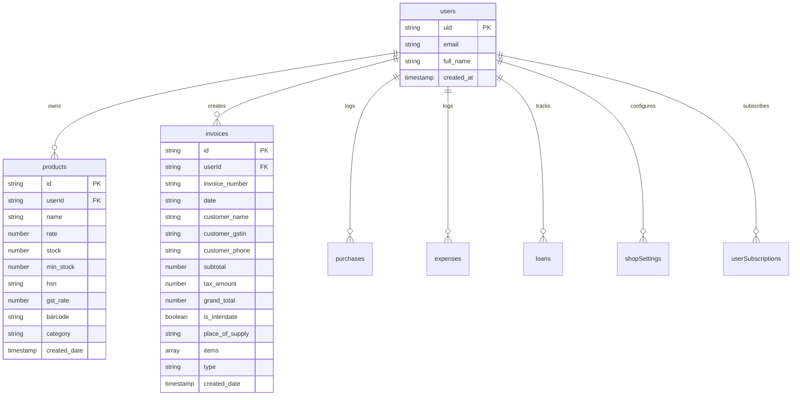

# Google Firebase Backend Database Schema & Architecture

This document defines the database architecture, schema collections, entity relations, and authentication integration for the **EasyBMT** platform.

---

## 1. Authentication Structure
We utilize **Firebase Authentication** for user identity management, enabling:
- **Email & Password Authentication**: Standard registration and login.
- **Google OAuth**: One-click registration/login.
- **Session Management**: Session tokens are automatically managed client-side using `getIdToken()` and stored securely in `localStorage` as fallback.

Upon successful login or state change (`onAuthStateChanged`), the user ID (`uid`) is populated and used to scope all Firestore operations.

---

## 2. Firestore Database Schema

Firestore collections are organized as flat, root-level collections. Every document in the user-related collections is tagged with a `userId` field matching the user's Firebase Auth `uid` for strict security isolation.

### Collection Definitions

### `invoices`
- **Purpose**: Stores all sales invoices, credit notes, and debit notes.
- **Fields**:
  - `userId` (string, indexed): ID of the business owner.
  - `invoice_number` (string): Format: `INV-2026-0001`.
  - `date` (string): YYYY-MM-DD format.
  - `customer_name` (string): Customer's name.
  - `customer_gstin` (string, optional): GSTIN of B2B client.
  - `customer_phone` (string, optional): Phone number.
  - `subtotal` (number): Taxable sales value.
  - `tax_amount` (number): Sum of CGST, SGST, or IGST.
  - `grand_total` (number): Invoice value including taxes.
  - `is_interstate` (boolean): `true` for IGST, `false` for CGST+SGST.
  - `place_of_supply` (string): State code + name (e.g. `27-Maharashtra`).
  - `items` (array): Array of nested item maps.
  - `type` (string): `sale`, `credit_note`, or `debit_note`.
  - `created_date` (string/timestamp): Date of creation.

### `products`
- **Purpose**: Stores product inventory, rates, HSN codes, and unique barcodes.
- **Fields**:
  - `userId` (string, indexed): Owner's ID.
  - `name` (string): Product title.
  - `rate` (number): Sale price (before tax).
  - `stock` (number): Real-time stock count.
  - `min_stock` (number): Reorder warning threshold.
  - `hsn` (string): Harmonized System of Nomenclature code.
  - `gst_rate` (number): GST tax percentage (e.g. `5`, `12`, `18`, `28`).
  - `barcode` (string, unique): Auto-generated UPC/EAN barcode.
  - `category` (string): Category grouping.

### `purchases`
- **Purpose**: Log inventory acquisitions for GSTR-3B ITC (Input Tax Credit) calculations.
- **Fields**:
  - `userId` (string, indexed)
  - `purchase_number` (string)
  - `date` (string)
  - `supplier_name` (string)
  - `grand_total` (number)

### `expenses`
- **Purpose**: Track operational expenses (rent, utilities, salaries).
- **Fields**:
  - `userId` (string, indexed)
  - `description` (string)
  - `amount` (number)
  - `date` (string)
  - `category` (string)

### `loans`
- **Purpose**: Tracks business liability accounts and repayments.
- **Fields**:
  - `userId` (string, indexed)
  - `lender_name` (string)
  - `amount` (number)
  - `interest_rate` (number)
  - `tenure_months` (number)

### `shopSettings`
- **Purpose**: Configures business identity details.
- **Fields**:
  - `userId` (string, unique index)
  - `shop_name` (string)
  - `gstin` (string)
  - `address` (string)
  - `phone` (string)
  - `invoice_counter` (number)
  - `logo_url` (string)

---

## 3. Real-Time Sync & Backup System
- **Real-Time Sync**: Enabled on the client-side using Firebase Firestore SDK, syncing data changes within milliseconds across multiple devices/tabs.
- **Backups**: Can be automated using Google Cloud Functions trigger running standard nightly backups to Google Cloud Storage bucket (`gs://[PROJECT_ID]-backups/`).
